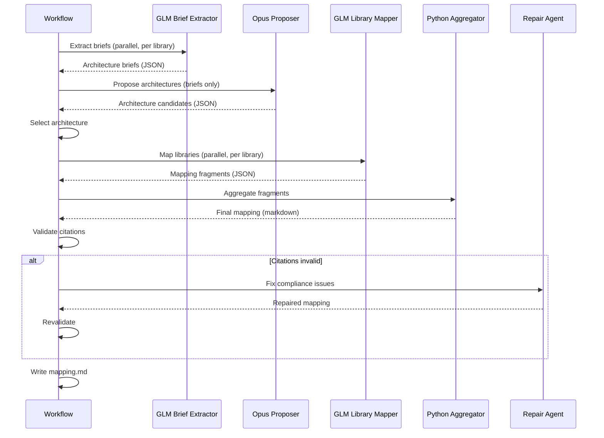

# Distributed Architecture Workflow

This workflow distributes architecture proposal inputs and library-to-component mapping across per-library GLM agents, aggregates results in Python, and enforces citation compliance against the library manifest.

## Brief Extraction Phase

- Run the GLM brief extractor once per library.
- Each brief includes intent, boundaries, dependencies, constraints, and interfaces with spec citations.
- Briefs are compact JSON inputs used for architecture proposal.

## Architecture Proposal Phase

- Opus proposes architecture candidates using library intents and compact briefs.
- Only brief summaries are provided (no full specs).
- Citations must reference library pointers.

## Distributed Mapping Phase

- Run the GLM library mapper once per library.
- Each mapper returns a JSON fragment: component, rationale, citations, and cross-component dependencies.

## Aggregation Phase

- Python aggregates fragments into component mappings.
- Cross-component dependencies and unmapped libraries are computed in code.
- Aggregated results are formatted into `mapping.md`.

## Citation Validation

- Citations are validated against the library manifest only.
- Allowed formats: `[lib_###::charter.md]` and `[lib_###::spec.md::SECTION]`.

## Repair Gate

- If citations are invalid or missing, the repair agent rewrites the mapping.
- Output is revalidated before writing `mapping.md`.

## Sequence Diagram

