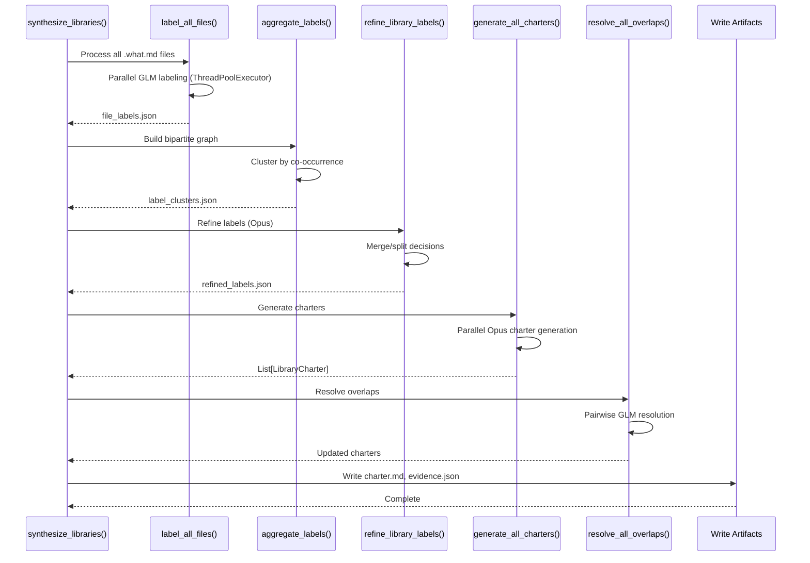

# Spec Refinement Workflow (Phase 2)

Phase 2 (library synthesis) is implemented as a distributed, five-step workflow to
avoid monolithic prompts and improve scalability on large codebases.

## Phase 2 Steps

GLM agents in this workflow use contract-first prompts. See
docs/development/glm-prompt-guidelines.md for the required structure.

### 2A. Per-file library labeling (GLM)

* Input: a single `summaries/*.what.md` file
* Output: `libraries/file_labels.json`
* Agent: `glm-file-library-labeler`
* Purpose: classify each file into capability-based library labels with evidence pointers

### 2B. Label aggregation + bipartite clustering (Python)

* Input: `libraries/file_labels.json`
* Output: `libraries/label_clusters.json`
* Purpose: build a bipartite graph of labels ↔ files and cluster labels by co-occurrence

### 2C. Label merge/split refinement (Opus)

* Input: aggregated cluster summaries (labels, file counts, similarity scores)
* Output: `libraries/refined_labels.json`
* Agent: `opus-library-label-refiner`
* Purpose: finalize stable library IDs and consolidate/split labels

### 2D. Parallel charter generation (Opus)

* Input: refined labels + relevant file summaries
* Output: `libraries/<lib_id>/charter.md` and `evidence.json`
* Agent: `opus-library-synthesizer`
* Purpose: generate library charters scoped to a single library at a time

### 2E. Pairwise overlap resolution (GLM)

* Input: pairs of potentially overlapping library charters
* Output: updated `overlap_resolutions` in each charter
* Agent: `glm-library-overlap-resolver`
* Purpose: resolve cross-library overlaps without global prompt failure

## Bipartite Clustering Algorithm

1. Build a label graph from per-file labels:
   * Nodes: labels
   * File sets: each label tracks the files it appears in
2. Compute co-occurrence similarity for label pairs using Jaccard:
   * `similarity = |files_A ∩ files_B| / |files_A ∪ files_B|`
3. Connect labels with similarity > 0.3
4. Connected components become candidate library clusters

## Overlap Resolution Decisions

The overlap resolver returns one of:

* `assign_to_lib_A`
* `assign_to_lib_B`
* `create_cross_cutting`
* `mark_shared_boundary`

Use assignment when overlap is clearly owned by one library. Use cross-cutting only
when the concern is truly shared and cannot be cleanly assigned.

## Intermediate Artifact Examples

### file_labels.json

```json
{
  "F0001": {
    "candidate_labels": [
      {
        "label": "Request Intake",
        "sections": ["[F0001::INTRO]"],
        "confidence": 0.8,
        "rationale": "Matches intake responsibilities."
      }
    ],
    "uncertain_labels": []
  }
}
```

### label_clusters.json

```json
{
  "label_clusters": [
    {
      "labels": ["Request Intake", "Inbound Routing"],
      "files": ["F0001", "F0004"],
      "file_sections": [["F0001", "INTRO"], ["F0004", "ROUTING"]],
      "similarity_score": 0.5
    }
  ],
  "singleton_labels": [
    {"label": "Rate Limiting", "files": ["F0007"]}
  ],
  "metadata": {
    "total_clusters": 1,
    "singleton_count": 1,
    "average_cluster_size": 2.0
  }
}
```

### refined_labels.json

```json
[
  {
    "lib_id": "LIB-0001",
    "final_label": "Request Intake",
    "merged_from": ["Request Intake", "Inbound Routing"],
    "split_notes": "",
    "stable_internal_id": "LIB-0001"
  }
]
```

### events.jsonl (per library)

```json
{"event_type":"LIBRARY_CREATED","timestamp":"2025-01-12T10:12:42","lib_id":"LIB-0001","metadata":{"created_from":["Request Intake","Inbound Routing"],"initial_intent":"Own request intake responsibilities.","initial_files":["F0001","F0004"]}}
{"event_type":"BOUNDARY_CHANGED","timestamp":"2025-01-13T09:05:10","lib_id":"LIB-0001","metadata":{"added_files":["F0007"],"removed_files":["F0004"],"reason":"Overlap resolution moved routing concerns."}}
```

## Phase 2 Sequence Diagram

