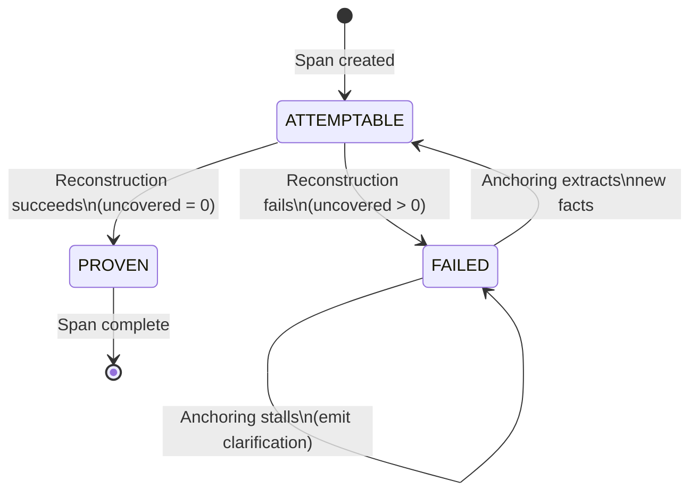

# Atomic Fact Extraction Data Models

This document describes the data models used by the atomic fact extraction system for span lifecycle management, dual representation, and validation artifact tracking.

## Overview

The `atomic_fact_models.py` module provides TypedDict-based data models that support:

1. **Span Lifecycle Management** - Track reconstruction progress through ATTEMPTABLE/PROVEN/FAILED states
2. **Dual Representation** - Maintain both canonical text (for search/deduplication) and source context (for reconstruction/provenance)
3. **Work Region Tracking** - Iterative extraction from unprocessed text intervals
4. **Validation Artifacts** - Record fabrication attempts, reconstruction failures, and clarification questions
5. **Progress Tracking** - Monitor anchoring attempts and determine when to emit clarifications

## Span Lifecycle State Machine



### State Definitions

| State | Meaning | Next Actions |
|-------|---------|--------------|
| `ATTEMPTABLE` | Sufficient coverage to attempt reconstruction | Run reconstruction proof |
| `PROVEN` | Reconstruction succeeded; sufficient facts extracted | Mark span complete |
| `FAILED` | Reconstruction failed; uncovered text remains | Attempt anchoring or emit clarification |

**Important**: PROVEN indicates the **reconstruction threshold** has been met (sufficient facts to rebuild original text), NOT that every possible fact has been extracted.

## Dual Representation

Each extracted fact has two representations serving distinct purposes:

### Canonical Fact Text

Used for **search, deduplication, and semantic operations**:

```python
{
    "canonical_text": "The device supports Bluetooth connectivity.",
    "subject": "The device",
    "predicate": "supports",
    "object": "Bluetooth connectivity"
}
```

- Self-contained and clear without original context
- Pronouns resolved (e.g., "It" → "The device") or marked with `UNKNOWN_REF_N` placeholders
- Normalized formatting, split conjunctions
- Used for hash-based deduplication

### Source Context

Used for **reconstruction, traceability, and provenance**:

```python
{
    "source_contexts": [
        {
            "doc_id": "doc-001",
            "start_char": 100,
            "end_char": 145,
            "verbatim_text": "It supports Bluetooth connectivity."
        }
    ]
}
```

- References work region(s) via character offsets
- Contains original phrasing, pronouns, unresolved references
- NOT ownership claims - multiple facts may share same context
- Enables reconstruction testing

## Base Fact vs. Implied Fact

### Base Fact

Directly extractable from source text grammar (SpaCy-validatable):

```python
from scripts.knowledge.atomic_fact_models import BaseFact, SourceContext

base_fact = BaseFact(
    fact_id="550e8400-e29b-41d4-a716-446655440000",
    fact_type="BASE_FACT",
    canonical_text="The device supports Bluetooth connectivity.",
    subject="The device",
    predicate="supports",
    object="Bluetooth connectivity",
    source_contexts=[
        SourceContext(
            doc_id="doc-001",
            start_char=100,
            end_char=145,
            verbatim_text="The device supports Bluetooth connectivity."
        )
    ],
    confidence=0.95,
    extracted_at="2025-01-15T10:35:00Z",
    validation_flags={
        "grammar_valid": True,
        "inference_valid": True,
        "atomicity_valid": True
    }
)
```

### Implied Fact

Derivable through logical inference from base facts:

```python
from scripts.knowledge.atomic_fact_models import ImpliedFact, SourceContext

implied_fact = ImpliedFact(
    fact_id="550e8400-e29b-41d4-a716-446655440001",
    fact_type="IMPLIED_FACT",
    canonical_text="Red flowers are on the floor.",
    subject="Red flowers",
    predicate="are on",
    object="the floor",
    source_contexts=[
        SourceContext(
            doc_id="doc-001",
            start_char=200,
            end_char=240,
            verbatim_text="red flowers scattered across the floor"
        )
    ],
    confidence=0.85,
    extracted_at="2025-01-15T10:36:00Z",
    validation_flags={
        "grammar_valid": True,
        "inference_valid": True,
        "atomicity_valid": True
    },
    inference_justification="Spatial containment: 'scattered across' implies 'on'",
    derived_from_fact_ids=["base-fact-001"]
)
```

## 8 Types of Illegal Fabrication

The system detects and rejects these fabrication types:

### Grammar Fabrications (SpaCy-detected)

| Type | Description | Example |
|------|-------------|---------|
| `HIDDEN_COPULA` | Adding verb to transform noun phrase | "red flowers" → "Red flowers ARE..." |
| `ATTRIBUTE_TO_PROCESS` | Converting adjective to temporal verb | "canonical string" → "string REMAINS canonical" |
| `PRONOUN_CONCORD` | Number/person/gender mismatch | "flowers...its hands" (plural/singular mismatch) |
| `TENSE_FABRICATION` | Assigning tense to timeless construction | "partition-style" → "WAS partition-style" |
| `FORCED_SUBJECT` | Inventing entity to complete triplet | "also buffalo sauce" → "(sauce, is in, SCENARIO)" |

### Inference Fabrications (Opus-detected)

| Type | Description | Example |
|------|-------------|---------|
| `INVALID_COREFERENCE` | Pronoun without valid antecedent | "its hands" with no singular entity |
| `UNGROUNDED_IMPLICATION` | Inference without logical basis | "portable" → "wireless" |
| `CONTEXT_BOUNDARY_VIOLATION` | Cross-section inference | Assuming "it" in section B refers to entity in section A |

### Fabrication Attempt Example

```python
from scripts.knowledge.atomic_fact_models import FabricationAttempt

fabrication = FabricationAttempt(
    attempt_id="550e8400-e29b-41d4-a716-446655440002",
    fabrication_type="HIDDEN_COPULA",
    attempted_fact={...},  # The rejected BaseFact
    source_span={...},     # Span where fabrication was attempted
    detection_method="spacy_grammar",
    violation_details="Source uses participial phrase 'scattered', not predicate. Verb 'are' was added.",
    detected_at="2025-01-15T10:40:00Z"
)
```

## Reconstruction Failure → Anchoring → Clarification Flow

When reconstruction fails, the system follows this progression:

```
1. Reconstruction attempt
   ↓ (fails with uncovered text)
2. Anchoring attempt (expanded context)
   ↓ (if progress made, return to 1)
   ↓ (if stalled after bounded attempts)
3. Emit Clarification Question
```

### Reconstruction Failure Example

```python
from scripts.knowledge.atomic_fact_models import ReconstructionFailure

failure = ReconstructionFailure(
    failure_id="550e8400-e29b-41d4-a716-446655440003",
    span_id="span-001",
    original_text="The device supports Bluetooth and Wi-Fi connectivity.",
    reconstructed_text="The device supports Bluetooth connectivity.",
    uncovered_phrases=["and Wi-Fi"],
    uncovered_offsets=[(32, 42)],
    facts_used=["fact-001"],
    proof_trace="Applied fact-001. Missing: conjunction and second connectivity type.",
    substitutions_used={},
    failed_at="2025-01-15T10:45:00Z"
)
```

### Anchoring Attempt Example

```python
from scripts.knowledge.atomic_fact_models import AnchoringAttempt

anchoring = AnchoringAttempt(
    attempt_id="550e8400-e29b-41d4-a716-446655440004",
    span_id="span-001",
    uncovered_phrase="and Wi-Fi",
    context_expansion_start=0,
    context_expansion_end=100,
    existing_facts_searched=["fact-001"],
    new_facts_extracted=["fact-002"],  # Wi-Fi fact extracted
    uncovered_reduction=10,  # Characters reduced
    succeeded=True,
    attempted_at="2025-01-15T10:46:00Z"
)
```

### Clarification Question Example

```python
from scripts.knowledge.atomic_fact_models import ClarificationQuestion

clarification = ClarificationQuestion(
    question_id="550e8400-e29b-41d4-a716-446655440005",
    doc_id="doc-001",
    start_char=500,
    end_char=550,
    verbatim_text="erupting from the palms of its hands",
    failure_statement="Cannot determine referent for 'its' - no singular entity in context",
    failure_type="anchoring_failure",
    bounded_attempts_count=3,
    author_response="",  # Empty until human responds
    emitted_at="2025-01-15T10:50:00Z"
)
```

## CSV Schema Documentation

### Span CSV Columns

```
span_id, start_char, end_char, state, text, doc_id, created_at, updated_at
```

### Fact CSV Columns

```
fact_id, fact_type, canonical_text, subject, predicate, object,
source_contexts_json, confidence, extracted_at, validation_flags_json,
inference_justification, derived_from_fact_ids_json
```

Note: Fields ending in `_json` contain JSON-encoded nested structures.

### Reconstruction Failure CSV Columns

```
failure_id, span_id, original_text, reconstructed_text,
uncovered_phrases_json, uncovered_offsets_json, facts_used_json,
proof_trace, substitutions_used_json, failed_at
```

### Clarification Question CSV Columns

```
question_id, doc_id, start_char, end_char, verbatim_text,
failure_statement, failure_type, bounded_attempts_count,
author_response, emitted_at
```

## JSON Schema Examples

### BaseFact JSON

```json
{
  "fact_id": "550e8400-e29b-41d4-a716-446655440000",
  "fact_type": "BASE_FACT",
  "canonical_text": "The device supports Bluetooth connectivity.",
  "subject": "The device",
  "predicate": "supports",
  "object": "Bluetooth connectivity",
  "source_contexts": [
    {
      "doc_id": "doc-001",
      "start_char": 100,
      "end_char": 145,
      "verbatim_text": "The device supports Bluetooth connectivity."
    }
  ],
  "confidence": 0.95,
  "extracted_at": "2025-01-15T10:35:00Z",
  "validation_flags": {
    "grammar_valid": true,
    "inference_valid": true,
    "atomicity_valid": true
  }
}
```

### ReconstructionFailure JSON

```json
{
  "failure_id": "550e8400-e29b-41d4-a716-446655440003",
  "span_id": "span-001",
  "original_text": "The device supports Bluetooth and Wi-Fi.",
  "reconstructed_text": "The device supports Bluetooth.",
  "uncovered_phrases": ["and Wi-Fi"],
  "uncovered_offsets": [[32, 42]],
  "facts_used": ["fact-001"],
  "proof_trace": "Applied fact-001. Missing: second connectivity type.",
  "substitutions_used": {},
  "failed_at": "2025-01-15T10:45:00Z"
}
```

## Usage Examples

### Creating and Validating a Span

```python
from scripts.knowledge.atomic_fact_models import (
    Span,
    validate_span_offsets,
    can_transition_to_proven,
)

# Create span
span = Span(
    span_id="new-span",
    start_char=0,
    end_char=100,
    state="ATTEMPTABLE",
    text="Example text...",
    doc_id="doc-001",
    created_at="2025-01-15T10:00:00Z",
    updated_at="2025-01-15T10:00:00Z",
)

# Validate offsets
canonical_string = "Example text..." + ("x" * 85)
is_valid = validate_span_offsets(span, len(canonical_string))

# Check if can transition to PROVEN
if can_transition_to_proven(span, uncovered_count=0, proof_trace="Proof..."):
    span["state"] = "PROVEN"
```

### Normalizing and Hashing Facts

```python
from scripts.knowledge.atomic_fact_models import (
    normalize_canonical_text,
    compute_fact_hash,
)

# Normalize text (basic whitespace handling)
raw_text = "  The   device   supports   Wi-Fi.  "
normalized = normalize_canonical_text(raw_text)
# Result: "The device supports Wi-Fi."

# Compute hash for deduplication
fact_hash = compute_fact_hash(
    canonical_text="The device supports Wi-Fi.",
    subject="The device",
    predicate="supports",
    obj="Wi-Fi",
)
```

**Normalization Rules:**

1. **Unicode normalization**: Text is normalized to NFC form
2. **Whitespace handling**: Leading/trailing whitespace is trimmed; internal runs of whitespace collapse to single spaces
3. **Quote normalization**: Curly quotes are converted to straight quotes
4. **Dash normalization**: Em-dashes and en-dashes are converted to hyphens:
   - `"device—supports"` (no spaces around em-dash) becomes `"device-supports"`
   - `"device — supports"` (with spaces around em-dash) becomes `"device - supports"` (spaces are preserved since whitespace collapses first, then dash is replaced)

### Serializing to CSV

```python
from scripts.knowledge.atomic_fact_models import (
    fact_to_csv_row,
    span_to_csv_row,
)

# Serialize for CSV storage
span_row = span_to_csv_row(span)
fact_row = fact_to_csv_row(base_fact)

# All values are strings, ready for CSV writer
```

## Model Categories Summary

| Category | Models | Purpose |
|----------|--------|---------|
| **Span & Work Regions** | `Span`, `WorkRegion`, `SpanLifecycleState` | Track text intervals and processing state |
| **Facts** | `BaseFact`, `ImpliedFact`, `EntityDeclaration`, `AttributeAnnotation` | Dual representation (canonical + source context) |
| **Validation Artifacts** | `FabricationAttempt`, `InvalidInferenceAttempt`, `ReconstructionFailure` | Track illegal fabrications and reconstruction failures |
| **Progress Tracking** | `AnchoringAttempt`, `ProgressTest`, `ClarificationQuestion` | Track anchoring iterations and clarification emission |
| **Utilities** | Normalization, CSV/JSON serialization, validation functions | Support operations on models |

## Integration Notes

- These models are **separate** from existing `FactStoreRecord` and `StructuralFactRecord` in `fact_store.py`
- Use the same normalization patterns (`normalize_canonical_text`) for consistency
- Atomic facts will be stored alongside existing facts but in separate CSV files
- DuckDB query patterns from `fact_store.py` can be reused for CSV operations
