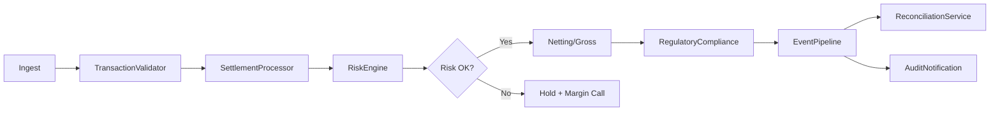

# Cross-System Invariants

Several invariants span multiple libraries and must hold at all times regardless of which processing path an instruction takes.

**Rate freshness invariant**: Any FX rate used for conversion must have been captured within the preceding 6 hours. If the rate cache returns a rate whose capture timestamp is older than 6 hours, the SettlementProcessor must emit a `rate.stale` alert on the EventPipeline before proceeding with conversion so that the operations team can verify the rate manually. This invariant applies to both the initial conversion in [settlement_processing.md](settlement_processing.md) and the independent rate fetch in the [reconciliation.md](reconciliation.md).

**Dead-letter audit invariant**: Every event that lands in the dead-letter queue must appear in the next daily regulatory summary produced by the RegulatoryCompliance module, regardless of the event's original topic. This ensures that dropped events are never silently lost.

**Settlement finality invariant**: Once a settlement instruction has been confirmed (see [settlement_processing.md](settlement_processing.md)) no system may mutate that record. Corrections are exclusively handled by issuing new offsetting instructions through the normal pipeline. Any attempt to modify a confirmed record must be rejected and logged as a `finality.violation` audit event.

The flow of a settlement through all eight components is:

The diagram above shows the happy path; error branches (validation rejection, risk hold, reconciliation break) each produce events that feed back into the EventPipeline and ultimately reach the AuditNotification service.

**Correlation tracing invariant**: The correlation ID assigned at ingestion by the TransactionValidator must propagate unchanged through every downstream event emitted by every library. Reconciliation, audit, and regulatory events all carry this ID, enabling end-to-end trace queries.
