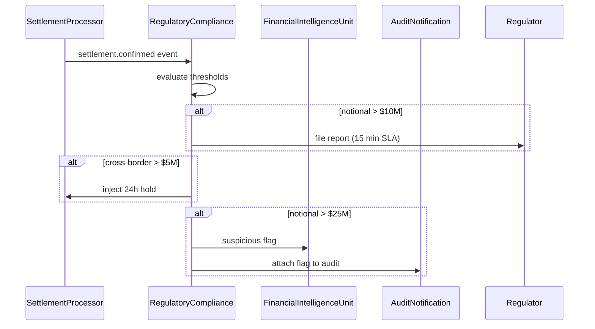

# Regulatory Compliance: DETAIL — ALGORITHM

([=ALG-LIB-04-001])
<!-- source: regulatory_compliance.md:3-3 -->
The RegulatoryCompliance module enforces reporting obligations and hold periods dictated by the applicable regulatory framework. Settlement transactions whose notional exceeds $10M must be reported to the regulator within 15 minutes of confirmation; the module listens for `settlement.confirmed` events and evaluates the notional against this threshold, queuing a regulatory report if the condition is met. Cross-border settlements with a notional exceeding $5M are subject to a 24-hour hold period during which the settlement cannot be finalised; the module injects a regulatory hold status into the settlement record and only releases it after the hold window has elapsed and no objection has been received from the compliance desk.

([=ALG-LIB-04-002])
<!-- source: regulatory_compliance.md:5-5 -->
Transactions above $25M trigger an additional suspicious-transaction flag that is forwarded to the financial-intelligence unit for review; this flag does not block settlement but must be attached to the audit snapshot so that the AuditNotification service can include it in downstream reports. The module also monitors for structuring patterns where a series of sub-threshold transactions from the same counterparty within a single business day aggregate to an amount that would have triggered the $10M reporting threshold had they been submitted as a single instruction, and if such a pattern is detected the entire series is retroactively reported.

([=ALG-LIB-04-003])
<!-- source: regulatory_compliance.md:9-9 -->
The compliance workflow is best understood through the following sequence:

([=ALG-LIB-04-004])
<!-- source: regulatory_compliance.md:11-29 -->

