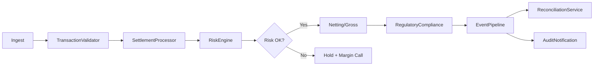

# System Architecture: DETAIL — ALGORITHM

([=ALG-LIB-08-001])
<!-- source: cross_system_invariants.md:11-25 -->
The flow of a settlement through all eight components is:

([=ALG-LIB-08-002])
<!-- source: cross_system_invariants.md:27-27 -->
The diagram above shows the happy path; error branches (validation rejection, risk hold, reconciliation break) each produce events that feed back into the EventPipeline and ultimately reach the AuditNotification service.

([=ALG-LIB-08-003])
<!-- source: overview.md:5-5 -->
The TransactionValidator performs upfront deduplication and schema validation before the SettlementProcessor decides whether a batch should be netted or sent through gross, and the SettlementProcessor consults the RiskEngine before any netting decision is finalised because the exposure windows maintained by the RiskEngine determine whether additional margin is required. If the RiskEngine flags an exposure breach the entire batch is held and a margin call is issued, which in turn must be recorded by the AuditNotification service so that compliance can review the event later. Meanwhile the EventPipeline carries every state transition as a typed event across the organisation, feeding the ReconciliationService which detects breaks between our internal ledger and the counterparty's acknowledgement. The RegulatoryCompliance module watches for reportable thresholds and hold-period triggers, injecting regulatory holds into the settlement flow before final confirmation. All of this must happen with enough speed that the AuditNotification service can persist a full snapshot within its latency budget while still routing alerts to the right team through the right channel.
