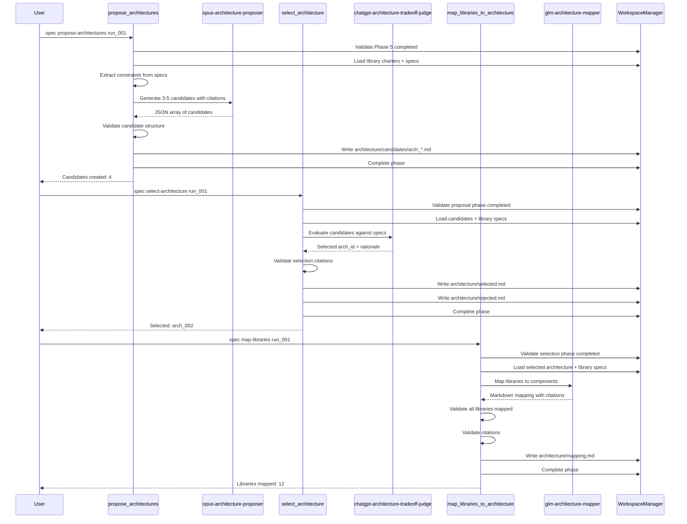

# Spec Refinement Workflows

## Sequential execution

```bash
uv run spec init my_run_001 ./specs
uv run spec spec summarize my_run_001
uv run spec spec synthesize my_run_001
```

## Resumability

Workflows write phase state to `runs/<run_id>/state.json`. Re-running a phase will
overwrite its outputs and refresh the phase status, making it safe to resume after
fixing inputs or agent configuration.

## Parallel tuning

Summarization uses a thread pool capped by `MAX_WORKERS` in
`scripts/spec_refinement/workflows/summarization.py`. Adjust this value when
processing large numbers of files.

## Output inspection

- Summaries: `runs/<run_id>/summaries/*.what.md`
- Library index: `runs/<run_id>/libraries/library_index.md`
- Library artifacts: `runs/<run_id>/libraries/<lib_id>/`
- Evidence maps: `runs/<run_id>/libraries/<lib_id>/evidence.json`

## Error recovery

Phase errors and issues are recorded in `runs/<run_id>/state.json`. Investigate
invalid evidence pointers or parsing issues in the recorded `issues` list, then
re-run the phase once corrected.

## Repair gate

Workflows use a validate -> repair -> revalidate gate to resolve compliance-only
issues automatically. The repair layer lives in
`scripts/spec_refinement/workflows/repair.py` and uses repair agents in
`.agents/agents/repair-*.md`. If repair succeeds, the corrected artifact is
written; if it fails, the original issues remain and a `repair_failed` issue is
added.

### Repair module API

- `repair_artifact(output, errors, allowlists, artifact_type, model_override, manager) -> str`
- `ArtifactType` enum maps to agent names via `_select_repair_agent`

### Adding a new artifact type

- Add the enum entry in `scripts/spec_refinement/workflows/repair.py`
- Map it to a new agent name in `_select_repair_agent`
- Create the agent definition in `.agents/agents/`
- Wire a validate -> repair -> revalidate gate in the workflow phase

## Python API

```python
from scripts.spec_refinement.workflows import summarize_all, synthesize_libraries

summarize_all("my_run_001")
synthesize_libraries("my_run_001")
```

## Phase 6: Architecture Proposal, Selection & Mapping

### Commands

- `uv run spec spec propose-architectures <run_id>`: Generate 3-5 architecture candidates
- `uv run spec spec select-architecture <run_id>`: Select best architecture via tradeoff analysis
- `uv run spec spec map-libraries <run_id>`: Map libraries to architecture components

### Agents

- **opus-architecture-proposer**: Generates architecture candidates with citations
- **chatgpt-architecture-tradeoff-judge**: Evaluates candidates against library specs
- **glm-architecture-mapper**: Distributes libraries across components

### Outputs

- `architecture/candidates/arch_*.md`: Architecture candidate descriptions
- `architecture/selected.md`: Selected architecture with rationale
- `architecture/rejected.md`: Rejected architectures with reasons
- `architecture/mapping.md`: Library-to-component mapping with citations

### Validation

- All architecture decisions must cite library constraints
- All libraries must be mapped to components
- Cross-component dependencies must be documented

## Workflow Diagram


