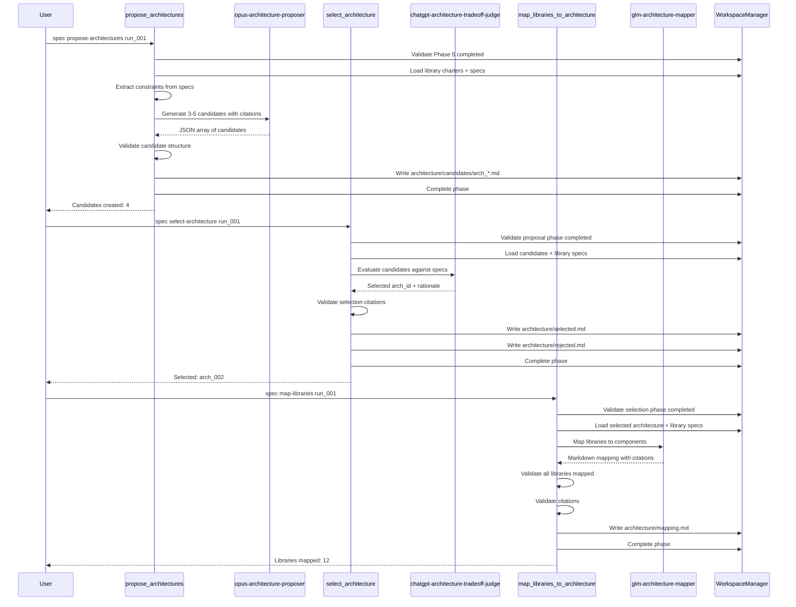
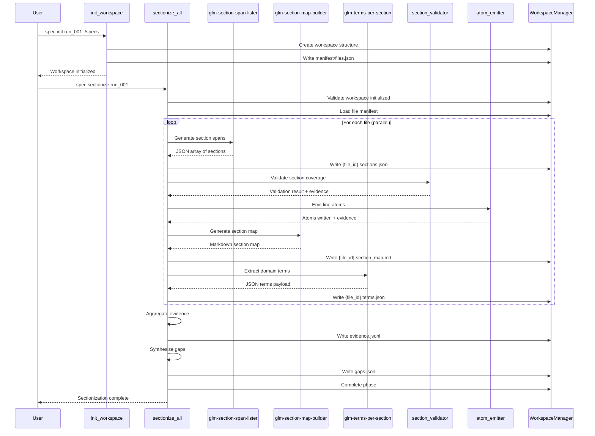

# Spec Refinement Workflows

## Sequential execution

```bash
uv run spec init my_run_001 ./specs
uv run spec spec summarize my_run_001
uv run spec spec synthesize my_run_001
```

## Resumability

Workflows write phase state to `runs/<run_id>/state.json`. Re-running a phase will
overwrite its outputs and refresh the phase status, making it safe to resume after
fixing inputs or agent configuration.

## Parallel tuning

Summarization uses a thread pool capped by `MAX_WORKERS` in
`scripts/spec_refinement/workflows/summarization.py`. Adjust this value when
processing large numbers of files.

## Output inspection

- Summaries: `runs/<run_id>/summaries/*.what.md`
- Library index: `runs/<run_id>/libraries/library_index.md`
- Library artifacts: `runs/<run_id>/libraries/<lib_id>/`
- Evidence maps: `runs/<run_id>/libraries/<lib_id>/evidence.json`

## Error recovery

Phase errors and issues are recorded in `runs/<run_id>/state.json`. Investigate
invalid evidence pointers or parsing issues in the recorded `issues` list, then
re-run the phase once corrected.

## Repair gate

Workflows use a validate -> repair -> revalidate gate to resolve compliance-only
issues automatically. The repair layer lives in
`scripts/spec_refinement/workflows/repair.py` and uses repair agents in
`.agents/agents/repair-*.md`. If repair succeeds, the corrected artifact is
written; if it fails, the original issues remain and a `repair_failed` issue is
added.

### Repair module API

- `repair_artifact(output, errors, allowlists, artifact_type, model_override, manager) -> tuple[str, list[dict[str, Any]]]`
- `ArtifactType` enum maps to agent names via `_select_repair_agent`

### Adding a new artifact type

- Add the enum entry in `scripts/spec_refinement/workflows/repair.py`
- Map it to a new agent name in `_select_repair_agent`
- Create the agent definition in `.agents/agents/`
- Wire a validate -> repair -> revalidate gate in the workflow phase

## Python API

```python
from scripts.spec_refinement.workflows import summarize_all, synthesize_libraries

summarize_all("my_run_001")
synthesize_libraries("my_run_001")
```

## Phase 1: Sectionization, Atomization, and Term Indexing

### Overview

Phase 1 converts each file in the spec snapshot into deterministic, line-based
atoms, section spans, and term indexes. It combines LLM-driven section and term
extraction with deterministic validators so downstream phases can rely on stable
identifiers and full line coverage.

### Commands

- `uv run spec spec sectionize <run_id>`: Run sectionization for all snapshot files

### Agents

- **glm-section-span-lister**: Emits JSON section spans with stable section IDs
- **glm-section-map-builder**: Produces a hierarchical section map in Markdown
- **glm-terms-per-section**: Extracts section-level and global domain terms

### Outputs

- `runs/<run_id>/manifest/sections/{file_id}.sections.json`
- `runs/<run_id>/manifest/sections/{file_id}.section_map.md`
- `runs/<run_id>/manifest/atoms/{file_id}.atoms.jsonl`
- `runs/<run_id>/manifest/terms/{file_id}.terms.json`
- `runs/<run_id>/workspace/intermediates/pass_01/evidence.jsonl`
- `runs/<run_id>/workspace/intermediates/pass_01/gaps.json`

### Validation

Phase 1 runs deterministic validation gates for section coverage, atom coverage,
and schema compliance. If any validator emits evidence, the phase is marked as
failed and issues are recorded in `runs/<run_id>/state.json`.

### Evidence Pointer Format Migration

Phase 1 introduces a new evidence pointer format to support stable section IDs.

**Old format** (deprecated):
- `[file_001::SECTION]` - Uses file_id and section label
- `[alpha.md::INTRO]` - Uses basename and section label
- Section labels are unstable and change when LLM regenerates sections

**New format** (Phase 1+):
- `[spec_snapshot/<relpath>::SEC-F0001-0001]` - Uses relpath and stable section_id
- `[spec_snapshot/alpha.md::SEC-F0001-0001]` - Explicit file path with section ID
- Section IDs are deterministic: `SEC-{file_id}-{ordinal:04d}`

**Migration touchpoints**:
- `scripts/spec_manager/spec_manager/refinement/formats.py` - Updated `EVIDENCE_POINTER_RE` regex
- `scripts/spec_refinement/workflows/summarization.py` - Passes section IDs to agents
- `scripts/spec_refinement/workflows/evidence_expansion.py` - Reads section IDs from sections.json
- `scripts/spec_refinement/qa/bad_signatures.py` - Updated validation patterns

**Backward compatibility**: The old format is still recognized during migration
but will be removed in Phase 2.

### Newline Handling

All Phase 1 inputs are normalized to LF (`\\n`) before processing. CRLF (`\\r\\n`)
and CR (`\\r`) sequences are converted to LF to ensure deterministic atom IDs and
hashes across platforms.

### Example Outputs

**Example sections.json**:
```json
{
  "file_id": "F0001",
  "sections": [
    {
      "section_id": "SEC-F0001-0001",
      "start_line": 1,
      "end_line": 15,
      "label": "OVERVIEW"
    },
    {
      "section_id": "SEC-F0001-0002",
      "start_line": 16,
      "end_line": 42,
      "label": "REQUIREMENTS"
    }
  ],
  "total_lines": 42
}
```

**Example atoms.jsonl** (2 lines):
```jsonl
{"atom_id":"ATOM-F0001-L0001","line_no":1,"section_id":"SEC-F0001-0001","sha256":"e3b0c44298fc1c149afbf4c8996fb92427ae41e4649b934ca495991b7852b855","text":"# Project Overview"}
{"atom_id":"ATOM-F0001-L0002","line_no":2,"section_id":"SEC-F0001-0001","sha256":"01ba4719c80b6fe911b091a7c05124b64eeece964e09c058ef8f9805daca546b","text":""}
```

**Example terms.json**:
```json
{
  "file_id": "F0001",
  "section_terms": [
    {
      "section_id": "SEC-F0001-0001",
      "terms": ["authentication", "authorization", "JWT"],
      "confidence": 0.85
    }
  ],
  "global_terms": ["API", "REST", "microservice"]
}
```

**Example section_map.md**:
```markdown
# Section Map: F0001
- SEC-F0001-0001: OVERVIEW
  - Project goals
  - Architecture summary
- SEC-F0001-0002: REQUIREMENTS
  - Functional requirements
  - Non-functional requirements
```

## Phase 6: Architecture Proposal, Selection & Mapping

### Commands

- `uv run spec spec propose-architectures <run_id>`: Generate 3-5 architecture candidates
- `uv run spec spec select-architecture <run_id>`: Select best architecture via tradeoff analysis
- `uv run spec spec map-libraries <run_id>`: Map libraries to architecture components

### Agents

- **opus-architecture-proposer**: Generates architecture candidates with citations
- **chatgpt-architecture-tradeoff-judge**: Evaluates candidates against library specs
- **glm-architecture-mapper**: Distributes libraries across components

### Outputs

- `architecture/candidates/arch_*.md`: Architecture candidate descriptions
- `architecture/selected.md`: Selected architecture with rationale
- `architecture/rejected.md`: Rejected architectures with reasons
- `architecture/mapping.md`: Library-to-component mapping with citations

### Validation

- All architecture decisions must cite library constraints
- All libraries must be mapped to components
- Cross-component dependencies must be documented

## Workflow Diagram



## Phase 1 Workflow Diagram


