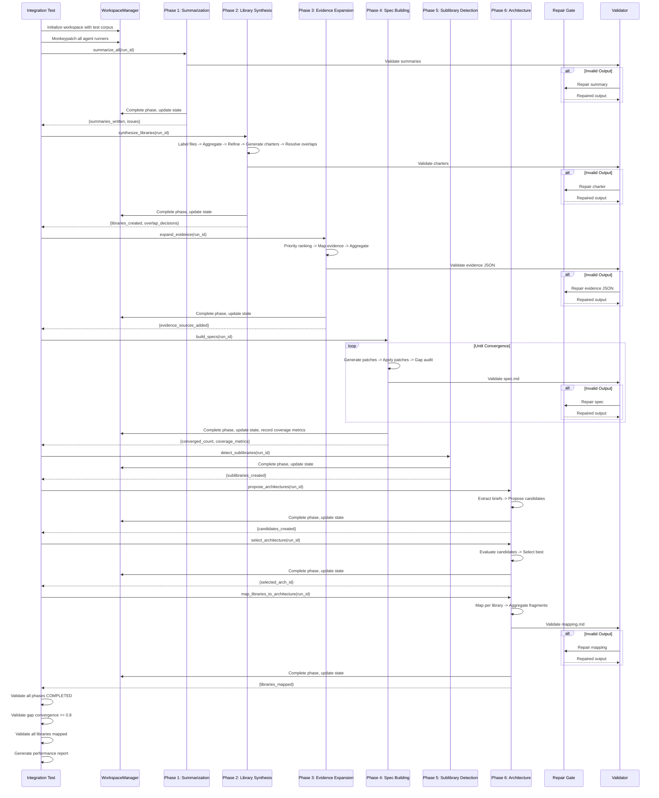

# Spec Refinement Integration Tests

## Overview
Comprehensive end-to-end tests for the 6-phase spec refinement workflow.

## Running Tests

### Full Suite
```bash
uv run pytest tests/spec_refinement/test_full_workflow.py -v
```

### Quick Tests (Skip Benchmarks)
```bash
uv run pytest tests/spec_refinement/test_full_workflow.py -m "not slow"
```

### Performance Benchmarks
```bash
uv run pytest tests/spec_refinement/test_full_workflow.py --benchmark-only
```

## Interface Tests
Interface tests validate the Phase 8 workflow: edge discovery, contract drafting, and validation/repair.

### Fixture Structure
- `create_interface_test_libraries` builds cross-referenced libraries under `runs/<run_id>/libraries/`.
- `interface_workspace` fixture initializes a workspace with interface libraries.
- `mock_interface_agents` provides interface-specific agent mocks with configurable violation modes.

### Running Interface Suites
```bash
uv run pytest tests/spec_refinement/test_interface_*.py -v
```

## Test Coverage
- Phase 1: Summarization (5 tests)
- Phase 2: Library Synthesis (6 tests)
- Phase 3: Evidence Expansion (4 tests)
- Phase 4: Spec Building (7 tests)
- Phase 5: Sublibrary Detection (3 tests)
- Phase 6: Architecture (5 tests)
- Full Workflow (3 tests)
- Edge Cases (10 tests)

## Fixtures
- Test corpus: 5-10 markdown files with known edge cases
- Mock agents: All 12 agent types with configurable failure rates
- Expected outputs: Validation schemas for all artifact types

## Performance Targets
- Total workflow time: < 60 seconds (mocked)
- Token usage: ~100,000 tokens for 10-file corpus
- Gap convergence: >= 80% per library
- Repair success rate: >= 80%

## Workflow Diagram


